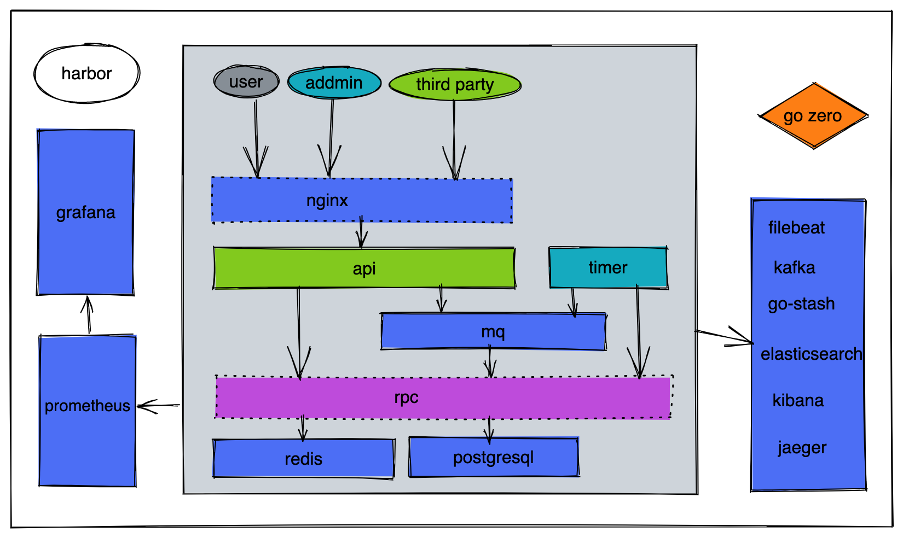

## Jakarta
### Summary 
    My own startup project server for online consultant service platform.
    Develop best practice projects based on the full technology stack of go-zero microservices.

### Technology Stack
    go-zero 
    nginx filebeat kafka go-stash elasticsearch kibana prometheus grafana jaeger
    go-queue asynq asynqmon
    postgresql redis
    docker docker-compose harbor
    wechat pay, wechat mini program

### System Architecture Diagram
   

### Project directory structure
    app: service include API, RPC, MQ, delay queue, schudule task, redis and postgresql model, tool.
    common: general components, error, global keyword, middleware, interceptor, ctxdata, third party api etc.
    deploy: test and production environment component service config, and some script.

### Business Summary
    user: recommend and inquiry consultants, pay for text or voice chat, refund, review, post content, apply to be a consultant
    consultant: provide chat service, apply refund, feedback user, reply user post content, get paid 
    admin: manage user, consultant, order, statistic data.
    Including not limited to the above features, details can be viewed at api.
    
### Gateway
    nginx for each api service.

### Service
    api service support http + json.
    rpc service support grpc + protobuf.
    mq service as consumers for mq.

### Log
    filebeat is used to collect them and report them to Kafka, go stash is used instead of logstash,
    logs store in elasticsearch, query log in kibina.

### Monitor
    Prometheus is used for collect, grafana as a dashboard to view.

### Link Tracking
    go-zero supports Jaeger and Zipkin by default. You only need to configure it.

### Message Queue
    kafka, publish subscription using go-zero development team developed by go-queue, link: https://github.com/zeromicro/go-queue
    Here we use kq, kq is based on kafka to do high-performance publish subscriptions

### Message queues, delayed queues, timed tasks
    Message queues, delay queues, timed tasks This project uses asynq, a simple middleware developed based on redis.
    Of course, the message queue you can also use go-queue
    Link: https://github.com/hibiken/asynq

### Deploy
    You can find the detail in deploy drectory.

### Thanks
    https://github.com/zeromicro/go-zero
    https://github.com/Mikaelemmmm/go-zero-looklook